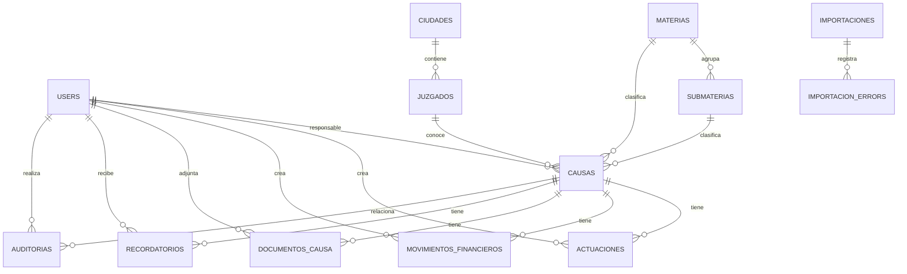

# SLAD — Sistema Logístico de Administración de Derecho

SLAD es una aplicación web para administrar causas jurídicas, sus antecedentes procesales, movimientos financieros, documentos, responsables, importaciones históricas y recordatorios. Está orientada al contexto chileno: valida RUT, utiliza la zona horaria `America/Santiago` y expresa los montos monetarios en pesos chilenos (CLP).

## Objetivo del sistema

El sistema centraliza la gestión de causas y reduce la dispersión de información jurídica. Permite registrar, consultar y controlar el avance de cada causa, resguardando el acceso según el rol y la responsabilidad asignada a cada usuario.

## Stack tecnológico

Las versiones corresponden a las dependencias instaladas en el proyecto.

| Componente | Versión / tecnología |
| --- | --- |
| PHP requerido | `^8.3` |
| Laravel Framework | 13.29.0 |
| Laravel Fortify | 1.38.0 |
| Livewire | 4.4.1 |
| Flux UI | 2.17.0 |
| Tailwind CSS | 4.x |
| Vite | 8.x |
| Maatwebsite Excel | 4.0.2 |
| Spatie Laravel Permission | 8.3.0 |
| Pest | 4.7.8 |
| Pest Laravel Plugin | 4.1.0 |
| Base de datos configurada localmente | MySQL |
| Cache, sesiones y colas configuradas localmente | Base de datos |

La interfaz usa Blade, componentes Livewire de archivo único y Flux UI. El proyecto también incorpora Fortify para autenticación, 2FA, passkeys, verificación de correo y restablecimiento de contraseña.

## Autenticación

SLAD autentica a los usuarios mediante **RUT y contraseña**. Fortify utiliza `rut` como nombre de usuario, no el correo electrónico.

- El RUT se normaliza antes de guardarse o validarse; se eliminan separadores y se conserva una forma uniforme.
- La regla `ValidChileanRut` y el soporte `ChileanRut` validan el dígito verificador mediante módulo 11.
- El acceso sólo se concede si el usuario existe, está activo y la contraseña coincide con el hash almacenado.
- Los intentos de inicio de sesión están limitados a **5 por minuto** por combinación de RUT e IP. El desafío de segundo factor también usa límite de 5 por minuto.
- Los usuarios inactivos no conservan permisos efectivos. Si ya tienen sesión, el middleware los desconecta, invalida la sesión y regenera el token CSRF.
- Fortify tiene habilitados restablecimiento de contraseña, verificación de correo, autenticación de dos factores y passkeys.
- Cuando `debe_cambiar_password` está activo, el usuario es redirigido al cambio inicial de contraseña antes de poder usar los módulos protegidos.

La aplicación incluye pantallas de registro, recuperación y restablecimiento por Fortify. La creación administrativa de usuarios y roles se controla también por permisos.

### Administrador inicial

Existe el comando interactivo:

```bash
php artisan slad:create-admin
```

También admite RUT, nombre y correo como argumentos/opciones. El comando valida los datos, crea un usuario activo, le asigna el rol `ADMINISTRADOR` y marca el correo como verificado.

## Usuarios

Los campos funcionales principales de `users` son:

| Campo | Uso |
| --- | --- |
| `id` | Identificador interno. |
| `name` | Nombre del usuario. |
| `rut` | Identificador de acceso; se almacena normalizado y debe ser válido. |
| `codigo` | Código interno para identificar responsables, especialmente al importar la columna `A CARGO` desde Excel. |
| `email` | Correo electrónico y soporte de verificación/restablecimiento. |
| `telefono` | Teléfono opcional. |
| `password` | Contraseña hasheada. |
| `activo` | Determina si puede autenticarse y ejercer permisos. |
| `debe_cambiar_password` | Obliga el cambio de contraseña inicial o temporal. |

Un usuario puede ser responsable de causas, creador de actuaciones y movimientos, ejecutor de importaciones, creador de recordatorios y destinatario de recordatorios.

## Roles y permisos

SLAD usa RBAC mediante `spatie/laravel-permission`. Los permisos se almacenan en las tablas de Spatie y se asignan a roles; los usuarios reciben roles. El método de permisos del modelo `User` además exige que el usuario esté activo.

### Roles existentes

| Rol | Finalidad | Alcance inicial |
| --- | --- | --- |
| `ADMINISTRADOR` | Administración completa. | Todos los permisos definidos. |
| `ABOGADO` | Gestión operativa y jurídica de sus causas. | Dashboard, causas, actuaciones, movimientos, documentos, recordatorios y consulta de catálogos. No posee permisos iniciales para reasignar responsables o recordatorios. |
| `CONSULTA` | Consulta de información. | Dashboard, causas, actuaciones, movimientos, documentos, recordatorios y catálogos en modo de consulta. |

Los permisos se crean mediante `RolePermissionSeeder`; el administrador se sincroniza con la lista completa de permisos. Las pantallas administrativas permiten gestionar usuarios, roles y permisos cuando el usuario cuenta con la autorización correspondiente.

### Permisos definidos

| Módulo | Permisos |
| --- | --- |
| Dashboard | `dashboard.ver` |
| Causas | `causas.ver`, `causas.ver-todas`, `causas.crear`, `causas.editar`, `causas.eliminar`, `causas.asignar-responsable` |
| Actuaciones | `actuaciones.ver`, `actuaciones.crear`, `actuaciones.editar`, `actuaciones.eliminar` |
| Movimientos financieros | `movimientos.ver`, `movimientos.crear`, `movimientos.editar`, `movimientos.eliminar` |
| Documentos | `documentos.ver`, `documentos.crear`, `documentos.eliminar` |
| Catálogos | `catalogos.ver`, `catalogos.crear`, `catalogos.editar`, `catalogos.desactivar` |
| Usuarios | `usuarios.ver`, `usuarios.crear`, `usuarios.editar`, `usuarios.desactivar`, `usuarios.asignar-roles` |
| Roles | `roles.ver`, `roles.crear`, `roles.editar`, `roles.eliminar`, `roles.asignar-permisos` |
| Importaciones | `importaciones.ver`, `importaciones.ejecutar` |
| Auditoría | `auditoria.ver` |
| Recordatorios | `recordatorios.ver`, `recordatorios.crear`, `recordatorios.editar`, `recordatorios.cancelar`, `recordatorios.asignar` |

Las policies de `Causa`, `Actuacion`, `MovimientoFinanciero`, `DocumentoCausa` y `Recordatorio` aplican autorización a nivel de registro, además de los middleware de ruta y verificaciones de permisos de las pantallas Livewire.

## Regla de acceso a causas

La visibilidad de una causa se define por la relación:

```text
causas.responsable_id → users.id
```

- Quien tiene `causas.ver-todas` puede ver todas las causas, incluidas las que no tienen responsable.
- Un usuario sin ese permiso sólo ve causas cuyo `responsable_id` coincide con su propio `id`.
- Por tanto, las causas sin responsable no son visibles para abogados o usuarios de consulta normales.
- La policy de causa replica esta regla para detalle, edición y eliminación.
- Las policies de actuaciones, movimientos, documentos y recordatorios delegan la comprobación de acceso en la causa relacionada.
- Los listados, búsquedas, filtros, dashboard, detalle, edición, impresión y recursos dependientes aplican esta restricción mediante `visibleFor()` y/o las policies correspondientes.

## Catálogos

Los mantenedores disponibles son:

- Materias.
- Submaterias.
- Ciudades.
- Juzgados.
- Direcciones.
- Estados procesales.
- Estados de causa.
- Acciones.

Las relaciones principales son:

```text
Materia → Submateria → Causa
Ciudad → Juzgado → Causa
Estado procesal → Causa y Actuación
Dirección / Acción / Estado de causa → Causa
```

Los catálogos disponen de un indicador `activo` cuando corresponde. La causa conserva las referencias históricas mediante claves foráneas; varios campos de catálogo pueden quedar en `null` si el registro relacionado se elimina o desactiva según la regla de la migración.

## Materias y submaterias

El seeder inicial incluye los siguientes códigos de materia:

```text
CS, CA, JPL, CIVIL, LABORAL, GRT, TA, TCP, TC, COBRANZA, OTRO
```

El código se conserva como nombre de materia. El proyecto no asigna significados expandidos para todos los códigos; por ello esta documentación no los interpreta. Sí existen submaterias iniciales para `CS`, `CA`, `CIVIL`, `COBRANZA`, `LABORAL`, `JPL`, `GRT`, `TC` y `OTRO`.

## Causas

El módulo de causas permite listar, buscar, filtrar, crear, editar, eliminar lógicamente y visualizar el detalle de una causa. El detalle reúne actuaciones, movimientos financieros, documentos autorizados y recordatorios.

### Campos principales

| Campo | Descripción |
| --- | --- |
| `nombre` | Nombre o carátula de la causa. |
| `numero_causa` | Número o identificador de causa; es texto (`string`) de hasta 100 caracteres, indexado y **no es único**. |
| `fecha_causa` / `fecha_ingreso` | Fechas de referencia e ingreso. |
| `juzgado_id` | Tribunal relacionado. |
| `materia_id` / `submateria_id` | Clasificación jurídica. La materia es obligatoria. |
| `estado_procesal_id` / `estado_causa_id` | Estados de la causa. |
| `direccion_id` / `accion_id` | Información administrativa y tipo de acción. |
| `responsable_id` | Usuario responsable y base de la regla de acceso. |
| `monto_demandado` | Monto de referencia de la demanda; no es un movimiento financiero. |
| `observacion_importante` | Observaciones relevantes. |
| `tiene_cotizaciones` | Indicador booleano. |

El listado permite filtros por año de ingreso, materia, responsable, estados, ciudad y juzgado, junto con búsqueda. La eliminación utiliza `SoftDeletes`; las causas eliminadas no aparecen en las consultas normales. La vista de detalle ofrece impresión de la causa.

## Actuaciones

Cada actuación pertenece a una causa y registra:

- fecha procesal opcional;
- descripción obligatoria;
- estado procesal opcional;
- usuario creador (`created_by`), cuando exista.

En el detalle de la causa se muestran por fecha descendente e identificador descendente. Crear, editar o eliminar una actuación requiere el permiso respectivo y acceso a la causa asociada. Las actuaciones también usan eliminación lógica.

## Movimientos financieros

Los movimientos financieros pertenecen a una causa y usan uno de estos tipos:

```text
INGRESO
EGRESO
```

Cada movimiento registra un monto, fecha opcional, observación y usuario creador. El monto se administra como valor positivo; el tipo determina si se suma como ingreso o egreso. El dashboard calcula:

- total de ingresos;
- total de egresos;
- saldo: ingresos menos egresos.

`monto_demandado` pertenece a la causa y no se incorpora como movimiento financiero. Los movimientos usan eliminación lógica y políticas equivalentes a las de actuaciones.

## Dashboard

El panel principal calcula sus indicadores sobre las causas visibles para el usuario autenticado y admite filtros. Incluye:

- total de causas;
- causas vigentes y cerradas;
- monto demandado;
- ingresos, egresos y saldo en CLP;
- causas sin responsable, sin estado procesal y sin actuaciones;
- distribución por materia, estado, estado procesal y responsable;
- ingreso mensual de causas, preservando meses sin datos en cero;
- variación anual de ingreso de causas respecto del año anterior;
- movimientos financieros mensuales;
- actividad procesal reciente;
- causas que requieren atención por falta de actuaciones;
- próximos recordatorios asignados al usuario conectado.

Los agregados se realizan en consultas SQL y el servicio carga relaciones necesarias para evitar consultas repetitivas en la interfaz.

## Importación histórica

El módulo de importación acepta archivos Excel `.xlsx` y `.xls` de hasta 10 MB. Cargar un archivo no importa datos automáticamente: primero se analiza y se presenta una previsualización; después se confirma la importación.

### Proceso

1. El archivo se guarda temporalmente en almacenamiento privado y se calcula su hash SHA-256.
2. Se inspecciona la primera hoja, sus encabezados y filas.
3. Se valida una estructura mínima: `NOMBRE CAUSA`, `MATERIA` y `NRO CAUSA` (o aliases reconocidos).
4. Se normalizan encabezados, textos, fechas, valores monetarios y campos booleanos.
5. Se detectan errores, advertencias, duplicados exactos y posibles duplicados.
6. Sólo filas con resultado `VÁLIDO` o `ADVERTENCIA` se procesan al confirmar.
7. La importación registra su resultado, resumen y errores por fila; los errores pueden descargarse en CSV.
8. Al finalizar —o al fallar— se elimina el archivo Excel temporal del almacenamiento privado.

El servicio usa una exclusión mutua por hash, evita confirmar dos veces el mismo archivo completado, procesa ítems en lotes de 100 y utiliza transacciones para crear cada causa.

### Mapeos relevantes

| Encabezado Excel | Destino |
| --- | --- |
| `NOMBRE CAUSA` | `causas.nombre` |
| `FECHA CAUSA` | `causas.fecha_causa` |
| `FECHA DE INGRESO` | `causas.fecha_ingreso` |
| `CIUDAD` + `JUZGADO` | Búsqueda de `juzgados` asociados a la ciudad. |
| `MATERIA` / `SUBMATERIA` | Catálogos y claves de la causa. |
| `ESTADO PROCESAL`, `DIRECCION`, `ACCION`, `ESTADO` | Catálogos de la causa. |
| `A CARGO` | `users.codigo` → `causas.responsable_id`. |
| `NRO CAUSA` | `causas.numero_causa`. |
| `MONTO DEMANDADO` | `causas.monto_demandado`. |
| `INGRESO` / `EGRESO` | Movimientos financieros de la causa. |
| `OBSERVACION CAUSA` | Actuaciones históricas procesadas. |
| `OBSERVACION IMPORTANTE` | `causas.observacion_importante`. |

Un código de responsable desconocido se informa como advertencia y no crea usuarios automáticamente. Las materias y submaterias nuevas sí se pueden crear durante la importación confirmada, dejando advertencia en el análisis previo. Una ciudad o juzgado no encontrado deja la causa sin juzgado; no se crea automáticamente.

### Observaciones históricas

`HistoricalActuationParser` intenta separar `OBSERVACION CAUSA` en actuaciones cuando encuentra secuencias con fecha y descripción. Si no puede separarlas con seguridad, conserva el texto completo como una sola actuación sin fecha y agrega una advertencia. Esto evita perder información histórica por un formato ambiguo.

## Documentos adjuntos

Las causas pueden recibir documentos PDF, si el usuario tiene el permiso correspondiente y acceso a la causa.

- Se aceptan sólo PDF con extensión, MIME `application/pdf` y cabecera válida `%PDF-`.
- El tamaño máximo configurable por defecto es **20 MB** mediante `SLAD_DOCUMENTS_MAX_SIZE_MB`.
- Los archivos se almacenan en el disco local privado, bajo `storage/app/private`, nunca directamente en `public`.
- Se generan nombres internos UUID, se conserva el nombre original y se calcula hash SHA-256.
- No se permite adjuntar el mismo hash dos veces a una misma causa.
- Si está configurado `SLAD_GHOSTSCRIPT_BINARY`, Ghostscript puede comprimir PDF de al menos 512 KiB; si falla o no reduce el tamaño, se conserva el original válido.
- La visualización y descarga pasan por un controlador que comprueba la policy y que el documento pertenezca a la causa solicitada.

No hay edición de metadatos de documentos. El permiso de eliminación quita el archivo del almacenamiento privado y elimina el registro asociado.

## Impresión

La vista de detalle de una causa incluye una acción de impresión. Utiliza `window.print()` y estilos `@media print` para producir una presentación A4 del detalle de la causa. La impresión se somete a la misma autorización de acceso que el detalle de la causa.

## Recordatorios y notificaciones

Cada recordatorio pertenece a una causa, tiene un destinatario y conserva:

| Campo | Uso |
| --- | --- |
| `causa_id` | Causa relacionada. |
| `user_id` | Usuario que recibirá el aviso. |
| `created_by` | Usuario que lo creó. |
| `titulo` / `descripcion` | Contenido del recordatorio. |
| `fecha_hora` | Momento del plazo o tarea. |
| `recordar_minutos_antes` | Anticipación configurada. |
| `notificar_en` | Momento calculado en que debe enviarse el aviso. |
| `estado` | `PENDIENTE`, `COMPLETADO` o `CANCELADO`. |
| `notificado_at` | Marca que evita avisos duplicados. |

La sección de recordatorios se muestra en el detalle de cada causa, debajo de actuaciones, para usuarios con `recordatorios.ver`. Se pueden crear, editar, completar o cancelar de acuerdo con los permisos. El destinatario predeterminado es el responsable de la causa; asignar a otra persona requiere `recordatorios.asignar` y el destinatario debe tener acceso a la causa.

### Scheduler y Laravel Notifications

El comando:

```bash
php artisan recordatorios:procesar
```

busca recordatorios pendientes, no notificados y cuyo `notificar_en` ya ocurrió. Procesa lotes de 100, marca el registro antes de notificar y entrega una `RecordatorioPendienteNotification` por el canal `database`. No se integra con calendarios ni mensajería externa.

La aplicación agenda este comando cada minuto y evita superposición de ejecuciones:

```php
Schedule::command('recordatorios:procesar')->everyMinute()->withoutOverlapping();
```

## Campana de notificaciones

La campana está disponible en la barra lateral de escritorio y el encabezado móvil. Muestra sólo notificaciones de recordatorios del usuario autenticado y permite:

- consultar el contador de no leídas;
- visualizar hasta ocho notificaciones recientes;
- ir a la causa relacionada;
- marcar una notificación individual como leída;
- marcar todas las notificaciones de recordatorio como leídas.

El componente se actualiza mediante sondeo Livewire cada 60 segundos.

## Auditoría

La bitácora almacena actividad de los modelos auditables y acciones explícitas de documentos y recordatorios. Cada registro puede incluir:

- usuario que realizó la acción;
- acción;
- clase y identificador del modelo;
- causa relacionada, cuando corresponde;
- valores anteriores y nuevos;
- fecha de creación;
- dirección IP;
- `user agent`.

Las acciones de recordatorio incluyen creación, modificación, reprogramación, completado y cancelación. El servicio excluye valores sensibles cuyo nombre contenga, entre otros: `password`, `password_confirmation`, `remember_token`, secretos 2FA, `token`, `secret`, `cookie` y `hash`.

## Seguridad

Las siguientes medidas están implementadas o configuradas en el código:

| Riesgo | Medida existente |
| --- | --- |
| Fuerza bruta | Rate limiting de login y 2FA con Fortify. |
| RUT inválido | Normalización y validación módulo 11 antes de autenticar o guardar. |
| Acceso no autorizado | Middleware de autenticación, usuario activo, cambio inicial de contraseña, correo verificado, permisos y policies por registro. |
| Manipulación de IDs | Policies y consultas que restringen recursos hijos por `causa_id`; el controlador de documentos también verifica pertenencia a la ruta. |
| SQL Injection | Eloquent y Query Builder parametrizados; no se construyen consultas SQL desde campos de usuario. |
| Mass assignment | Modelos con listas `Fillable` explícitas. |
| XSS | Las vistas Blade imprimen datos mediante sintaxis escapada; no se observan salidas HTML no confiables intencionales en los módulos documentados. |
| CSRF | Middleware web estándar de Laravel y tokens CSRF en formularios. |
| Archivos maliciosos | Validación de tipo/extensión, comprobación de cabecera PDF, tamaño máximo, hash y almacenamiento privado. |
| Exposición de adjuntos | Disco `local` privado con `serve => false`; descarga y visualización autorizadas por controlador. |
| Sesiones | Driver de base de datos; invalidación y regeneración de token al desactivar un usuario. |
| Cabeceras | `X-Content-Type-Options`, `X-Frame-Options`, `Referrer-Policy` y `Permissions-Policy`. HSTS se añade si la solicitud es segura y el entorno es producción. |

La configuración de ejemplo no activa cifrado de sesión (`SESSION_ENCRYPT=false`) ni obliga cookies seguras por sí sola. En producción se debe usar HTTPS y definir las opciones de cookie seguras apropiadas en el entorno y servidor web. No se identificó una política CSP personalizada en el proyecto.

## Base de datos

Las tablas funcionales principales incluyen:

| Tabla | Propósito |
| --- | --- |
| `users` | Usuarios, credenciales, perfil y estado. |
| `roles`, `permissions` y tablas `model_has_*` / `role_has_permissions` | RBAC de Spatie. |
| `causas` | Expedientes jurídicos. |
| `materias`, `submaterias` | Clasificación jurídica. |
| `ciudades`, `juzgados` | Ubicación y tribunales. |
| `direcciones`, `acciones`, `estados_procesales`, `estados_causa` | Catálogos de causa. |
| `actuaciones` | Historial procesal. |
| `movimientos_financieros` | Ingresos y egresos. |
| `documentos_causa` | Metadatos de PDF privados. |
| `recordatorios` | Agenda y estados de recordatorios. |
| `notifications` | Notificaciones internas de Laravel. |
| `auditorias` | Bitácora de cambios. |
| `importaciones`, `importacion_errors` | Control y errores de importaciones Excel. |
| `sessions`, `cache`, `jobs`, `job_batches`, `failed_jobs` | Infraestructura Laravel configurada para base de datos. |
| `passkeys` | Credenciales WebAuthn. |

### Diagrama simplificado



## Estructura del proyecto

```text
app/
├── Actions/                 # Acciones de Fortify, causas, actuaciones y movimientos
├── Console/Commands/        # Administrador inicial y procesamiento de recordatorios
├── Enums/                   # Roles, permisos, estados y tipos
├── Http/                    # Middleware y controlador de documentos
├── Models/                  # Modelos Eloquent
├── Notifications/           # Notificaciones internas
├── Policies/                # Autorización por recurso
├── Services/                # Dashboard, auditoría, PDFs, recordatorios e importación
└── Support/                 # Utilidad de RUT chileno

database/
├── factories/
├── migrations/
└── seeders/

resources/views/
├── components/              # Componentes Livewire y Blade
├── pages/                   # Páginas administrativas, causas, autenticación y catálogos
└── layouts/

tests/
├── Feature/                 # Pruebas de módulos y autorización
└── Unit/                    # Pruebas del RUT y unidades
```

No hay un directorio `app/Jobs` ni jobs de aplicación implementados actualmente.

## Instalación en desarrollo

Desde una copia del repositorio:

```bash
composer install
npm install
copy .env.example .env
php artisan key:generate
php artisan migrate --seed
npm run build
php artisan serve
```

En PowerShell puede usarse `Copy-Item .env.example .env` en lugar de `copy`. Configure los datos de MySQL en `.env` antes de ejecutar migraciones. Para desarrollo simultáneo de servidor, cola y Vite, el proyecto ofrece:

```bash
composer run dev
```

Para crear el primer administrador, ejecute después de los seeders:

```bash
php artisan slad:create-admin
```

## Variables de entorno relevantes

No se deben incluir secretos reales en el repositorio. Las variables importantes son:

| Variable | Uso |
| --- | --- |
| `APP_ENV`, `APP_DEBUG`, `APP_KEY`, `APP_URL` | Entorno y configuración base de Laravel. |
| `DB_CONNECTION`, `DB_HOST`, `DB_PORT`, `DB_DATABASE`, `DB_USERNAME`, `DB_PASSWORD` | Base de datos. |
| `SESSION_DRIVER`, `SESSION_LIFETIME`, `SESSION_ENCRYPT` | Sesiones. |
| `CACHE_STORE` | Almacenamiento de cache. |
| `QUEUE_CONNECTION` | Driver de colas; el ejemplo usa `database`. |
| `FILESYSTEM_DISK` | Disco por defecto; los archivos privados usan explícitamente `local`. |
| `MAIL_*` | Configuración de correo de Fortify y notificaciones generales. |
| `PASSKEYS_USER_HANDLE_SECRET` | Secreto opcional para passkeys. |
| `SLAD_DOCUMENTS_MAX_SIZE_MB` | Máximo de MB permitidos para adjuntos PDF. |
| `SLAD_GHOSTSCRIPT_BINARY` | Ruta o binario de Ghostscript para compresión opcional. |

## Scheduler

El scheduler no se ejecuta automáticamente por Laravel en un servidor. Debe configurarse una sola tarea cron de producción para el usuario que ejecuta PHP:

```cron
* * * * * cd /ruta/a/slad && php artisan schedule:run >> /dev/null 2>&1
```

Esto permite ejecutar el procesamiento de recordatorios cada minuto. La guía específica también está disponible en [`docs/recordatorios-scheduler.md`](docs/recordatorios-scheduler.md).

## Colas

La configuración de ejemplo usa `QUEUE_CONNECTION=database` y el script `composer run dev` inicia `php artisan queue:listen`. Sin embargo, no se encontraron jobs propios en `app/Jobs` ni tareas de negocio que se despachen explícitamente a la cola. El procesamiento de recordatorios se realiza por el scheduler y la notificación de base de datos se envía de forma síncrona.

Si se incorporan trabajos asíncronos, será necesario mantener un worker en producción, por ejemplo:

```bash
php artisan queue:work
```

## Pruebas

La suite está escrita con Pest y utiliza `RefreshDatabase` para las pruebas de funcionalidad. Se ejecuta con:

```bash
php artisan test
```

Las pruebas existentes cubren, entre otros, autenticación y RUT, gestión de usuarios y roles, autorización de causas, catálogos, actuaciones, movimientos, dashboard, impresión, documentos privados, importación histórica, auditoría, recordatorios y campana de notificaciones. No se declara una cobertura porcentual medida.

## Optimización y rendimiento

El proyecto incorpora las siguientes prácticas observables:

- índices en claves foráneas, fechas, números de causa, estados de importación y búsquedas de recordatorios;
- índices compuestos para causa/fecha, usuario/estado/fecha de recordatorios y procesamiento de notificaciones pendientes;
- eager loading en dashboard, importaciones y componentes para reducir N+1;
- paginación en los listados Livewire;
- agregaciones SQL para resúmenes y gráficos del dashboard;
- procesamiento de importaciones en lotes de 100 y transacciones por fila;
- exclusión mutua de importación por hash;
- procesamiento de recordatorios en lotes de 100;
- prevención de lazy loading en entorno local mediante `AppServiceProvider`.

## Producción

Antes de publicar SLAD se recomienda verificar como mínimo:

- `APP_ENV=production` y `APP_DEBUG=false`;
- `APP_URL` con HTTPS;
- credenciales de base de datos seguras y respaldos probados;
- tarea cron del scheduler configurada;
- permisos de escritura para `storage` y `bootstrap/cache`;
- respaldo de la base de datos y de `storage/app/private`, que contiene adjuntos e importaciones temporales;
- configuración segura de cookies de sesión y HTTPS a nivel de servidor;
- Ghostscript instalado sólo si se desea usar la compresión opcional de PDF;
- worker de colas sólo si se empiezan a despachar trabajos asíncronos;
- ejecución de migraciones y seeders según el procedimiento de despliegue definido.

## Licencia

SLAD es software propietario. Su uso, copia, modificación, distribución y comercialización están sujetos a las condiciones del archivo [`LICENSE.md`](LICENSE.md). No debe tratarse como software libre ni como código abierto.

## Estado actual

| Módulo | Estado | Observación |
| --- | --- | --- |
| Autenticación, RUT, 2FA, passkeys y verificación | Implementado | Configurados a través de Fortify. |
| Usuarios, roles y permisos | Implementado | RBAC con Spatie Permission. |
| Catálogos | Implementado | Incluye seeders de materias, submaterias, ciudades, juzgados, direcciones y estados. |
| Causas | Implementado | Incluye acceso por responsable, filtros, soft delete e impresión. |
| Actuaciones y movimientos | Implementado | Con policies y auditoría mediante modelos auditables. |
| Dashboard | Implementado | Indicadores, gráficos y agenda personal. |
| Importación histórica | Implementado | Análisis, previsualización, validación, errores CSV e importación confirmada. |
| Documentos PDF | Implementado | Almacenamiento privado, validación, hash y compresión opcional. |
| Auditoría | Implementado | Bitácora y filtro de datos sensibles. |
| Recordatorios y notificaciones internas | Implementado | Requiere cron de producción para el aviso automático. |
| Integración con calendarios, correo o mensajería externa para recordatorios | Pendiente / no implementado | Las notificaciones actuales sólo usan la base de datos de Laravel. |
| Jobs de negocio asíncronos | Pendiente / no implementado | Hay infraestructura de cola, pero no jobs propios. |
